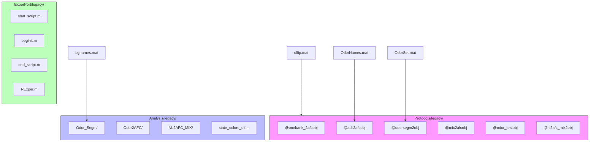
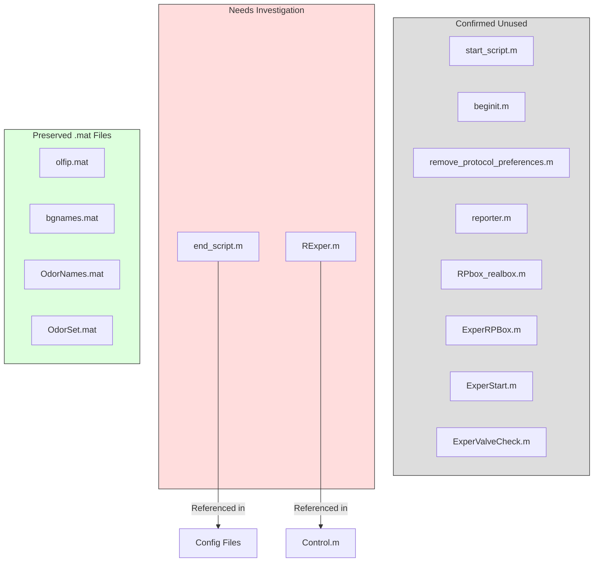

# Legacy Architecture and Cleanup Tracking

This document tracks legacy components, their current status, and relationships. It serves as a temporary reference during the cleanup process and will be updated as components are fully deprecated or removed.

## Legacy Component Organization

The following diagram shows the current organization of legacy components and their relationships:

## Investigation Status

The following diagram shows the current investigation status of legacy components:

## Component Status Details

### Confirmed Unused Components
These components have been confirmed as unused and moved to legacy folders:

1. **ExperPort Legacy** (Commit: 67d64ada04815d3e676f8d651ee90ac35883c4f9)
   - `start_script.m`
   - `beginit.m`
   - `remove_protocol_preferences.m`
   - `reporter.m`
   - `RPbox_realbox.m`
   - `ExperRPBox.m`
   - `ExperStart.m`
   - `ExperValveCheck.m`

### Under Investigation
Components requiring further analysis before final disposition:

1. **ExperPort Components**
   - `end_script.m`: Referenced in configuration files
   - `RExper.m`: Referenced in Control.m
   
### Preserved Data Files
Critical data files maintained despite legacy status of dependent components:

1. **olfip.mat Related** (Commit: 1c8b5d799155912251a1b6ac44881e3b8e00983d)
   - File preserved while 15 dependent protocol folders moved to legacy
   - May be needed by other components

2. **Other .mat Files** (Commit: b714b1848ac6d1bf70e666daa3f85338b403169f)
   - `bgnames.mat`
   - `OdorNames.mat`
   - `OdorSet.mat`
   - All preserved while dependent protocols moved to legacy

## Monitoring Plan

### Components Under Investigation
1. **end_script.m**
   - Monitor configuration file dependencies
   - Track any runtime references
   - Document any discovered usage patterns

2. **RExper.m**
   - Monitor Control.m interactions
   - Track any indirect dependencies
   - Document any system impacts

### Investigation Timeline
- Investigation Period: [Define specific timeframe]
- Review Points: [Define review schedule]
- Final Disposition Date: [Define target date]

## Rollback Procedures

For any needed rollbacks, follow this sequence (from newest to oldest):

1. ExperPort Files (67d64ada04815d3e676f8d651ee90ac35883c4f9)
2. Analysis/Protocol Files (b714b1848ac6d1bf70e666daa3f85338b403169f)
3. Olfip.mat Protocols (1c8b5d799155912251a1b6ac44881e3b8e00983d)
4. Newstartup Refactoring (60932b71d39853a25725e5c52ff2788942cbf243)
5. Unused Code Removal (5da710d356f8385dcfebd856b9ad3c57f2fc50b1)
6. Documentation/Paths (ce835f7a3a290c03fdd847480887898ce7cac6b6)

## Next Steps

1. **Investigation Tasks**
   - Complete analysis of `end_script.m` dependencies
   - Verify `RExper.m` usage patterns
   - Document any discovered integrations

2. **Documentation Updates**
   - Maintain investigation findings
   - Update status as components are cleared
   - Document any new dependencies discovered

3. **Final Disposition**
   - Plan for permanent removal of confirmed unused components
   - Document any components that need to be retained
   - Update system documentation accordingly 