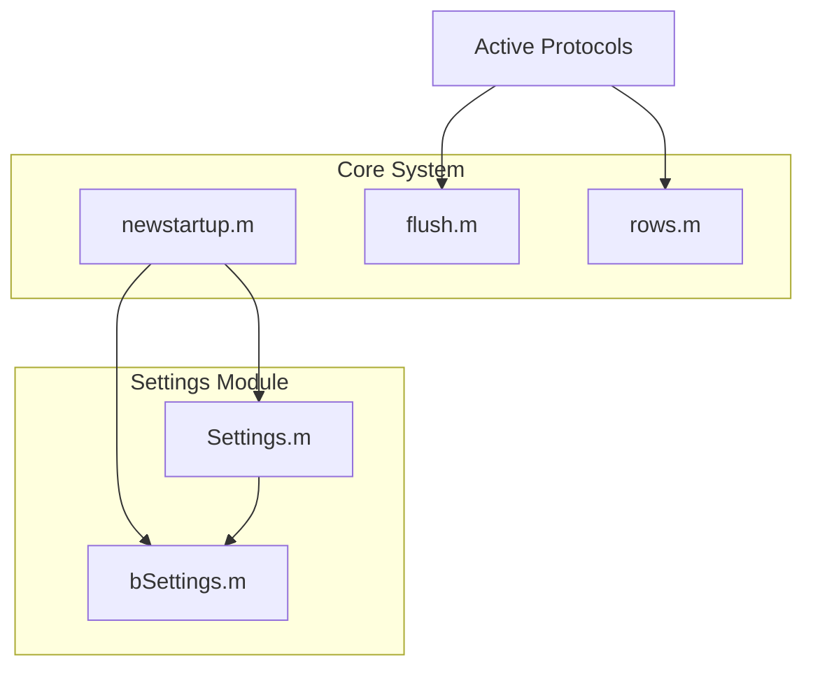
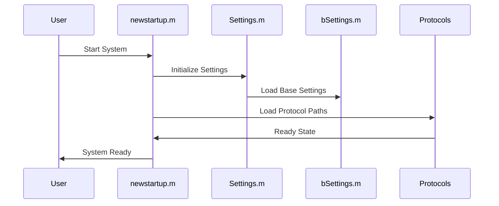

# System Architecture

This document outlines the permanent architecture of the system, including core components, their relationships, and key workflows.

## Core System Components

The following diagram shows the high-level architecture of active system components and their relationships:

### Component Descriptions

1. **Core System**
   - `newstartup.m`: Core system initialization script that sets up paths, loads settings, and prepares the environment
   - `flush.m`: Handles flushing operations, used extensively in protocol files
   - `rows.m`: Provides matrix operation functionality used throughout the codebase

2. **Settings Module**
   - `Settings.m`: Main settings management module
   - `bSettings.m`: Base settings configuration
   - These components work together to maintain system configuration

## System Startup Sequence

The following sequence diagram illustrates the system initialization process:

### Startup Process Details

1. **System Initialization**
   - User triggers system start
   - `newstartup.m` begins initialization sequence

2. **Settings Configuration**
   - Settings module is initialized
   - Base settings are loaded and configured
   - System paths are established

3. **Protocol Loading**
   - Protocol paths are configured
   - Active protocols are made available

4. **System Ready State**
   - All components initialized
   - System ready for operation

## Dependencies and Requirements

1. **Core Dependencies**
   - MATLAB environment
   - Required toolboxes (list specific versions if applicable)
   - System-specific configurations

2. **Protocol Requirements**
   - Each protocol must implement specific interfaces
   - Protocols must handle flush operations appropriately
   - Matrix operations should utilize `rows.m` for consistency

## Best Practices

1. **Protocol Development**
   - Always use `flush.m` for cleanup operations
   - Implement proper error handling
   - Follow established naming conventions

2. **System Configuration**
   - Maintain settings in appropriate modules
   - Document any changes to core components
   - Follow established backup procedures

## Maintenance Guidelines

1. **Core Components**
   - Regular testing of startup sequence
   - Validation of settings management
   - Performance monitoring of critical operations

2. **Documentation**
   - Keep this architecture document updated
   - Document any new dependencies
   - Maintain clear protocol documentation 