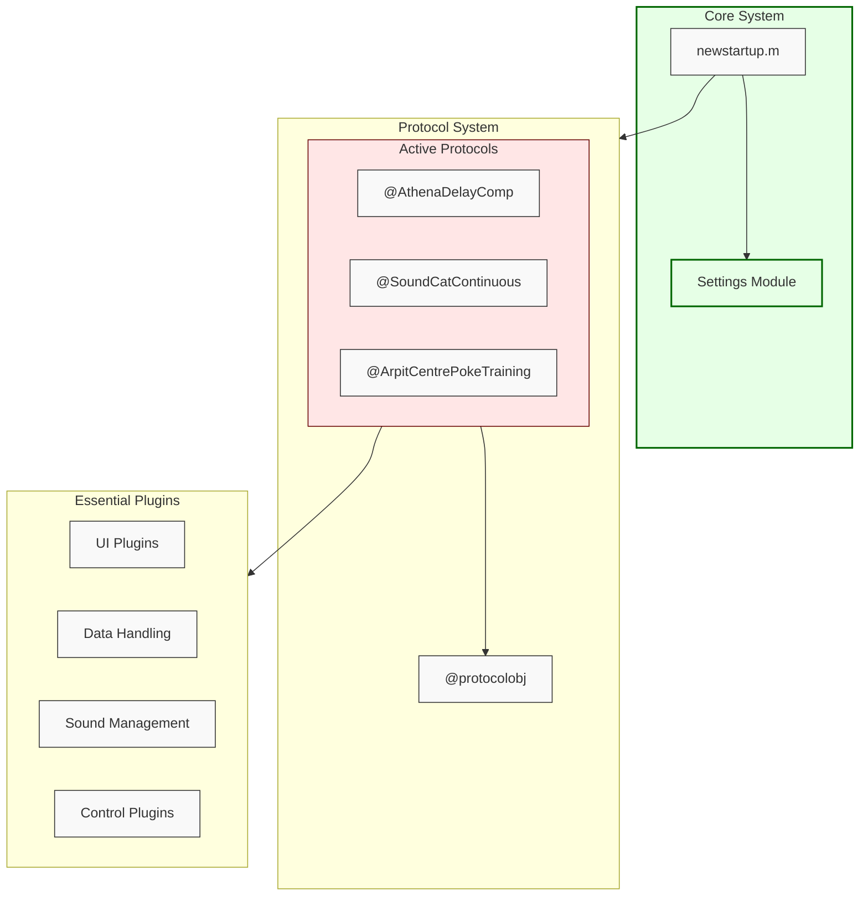
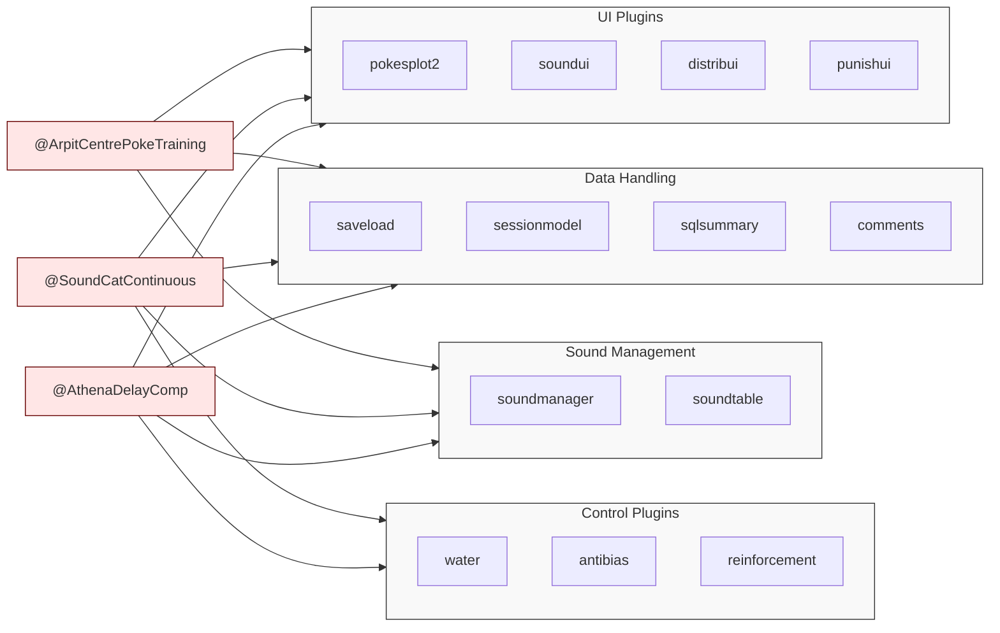
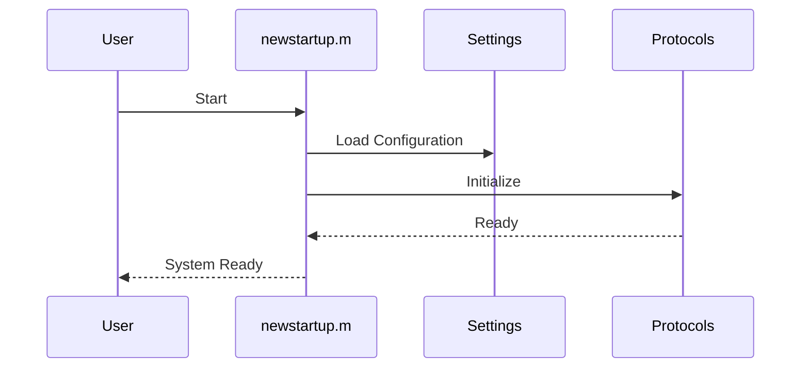
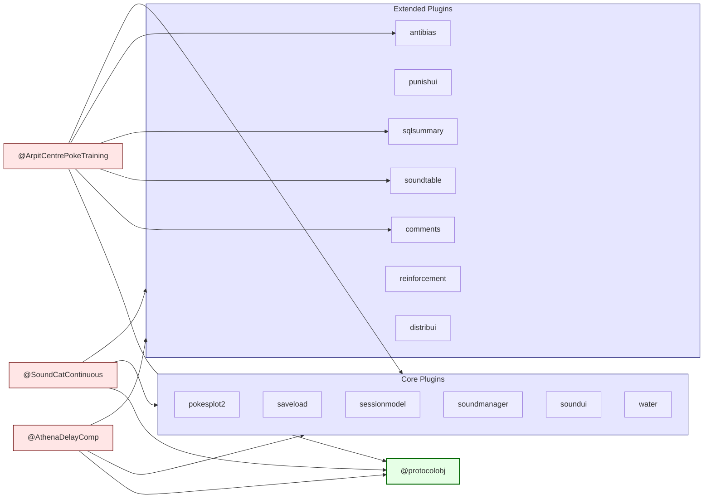

# System Architecture

This document outlines the permanent architecture of the system, including core components, their relationships, and key workflows.

## Core System Components

## Protocol Plugin Details

## System Startup Flow

## Key Components

1. **Core System**
   - `newstartup.m`: System initialization
   - Settings Module: Configuration management

2. **Active Protocols**
   - `@AthenaDelayComp`: Full plugin suite
   - `@SoundCatContinuous`: Full plugin suite
   - `@ArpitCentrePokeTraining`: Basic plugin set

3. **Plugin Categories**
   - UI: Visual interfaces and plotting
   - Data: Storage and session management
   - Sound: Audio control and management
   - Control: Hardware and behavior control

## Plugin Usage

| Protocol | UI | Data | Sound | Control |
|----------|-------|--------|--------|----------|
| AthenaDelayComp | ✓ | ✓ | ✓ | ✓ |
| SoundCatContinuous | ✓ | ✓ | ✓ | ✓ |
| ArpitCentrePokeTraining | ✓ | ✓ | ✓ | - |

## Dependencies and Requirements

1. **Core Dependencies**
   - MATLAB environment
   - Required toolboxes (list specific versions if applicable)
   - System-specific configurations

2. **Protocol Requirements**
   - Each protocol must implement specific interfaces
   - Protocols must handle flush operations appropriately
   - Matrix operations should utilize `rows.m` for consistency

## Best Practices

1. **Protocol Development**
   - Always use `flush.m` for cleanup operations
   - Implement proper error handling
   - Follow established naming conventions

2. **System Configuration**
   - Maintain settings in appropriate modules
   - Document any changes to core components
   - Follow established backup procedures

## Maintenance Guidelines

1. **Core Components**
   - Regular testing of startup sequence
   - Validation of settings management
   - Performance monitoring of critical operations

2. **Documentation**
   - Keep this architecture document updated
   - Document any new dependencies
   - Maintain clear protocol documentation

## Protocol Class Hierarchy

