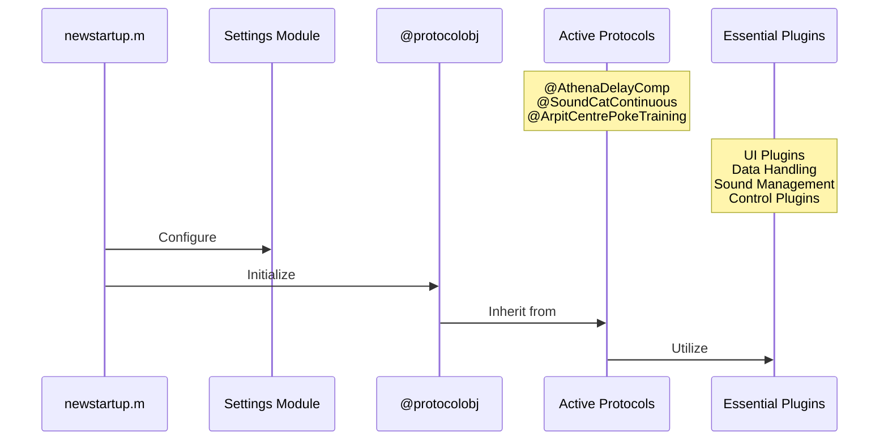
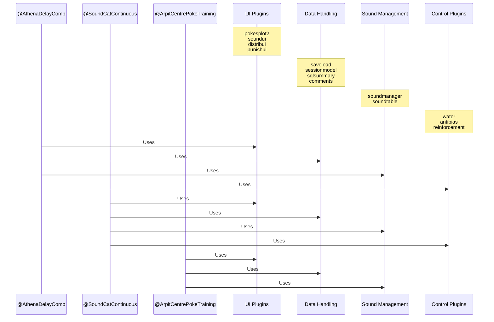
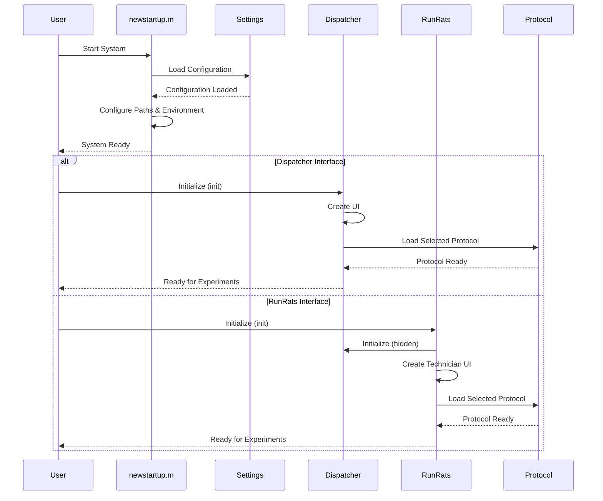
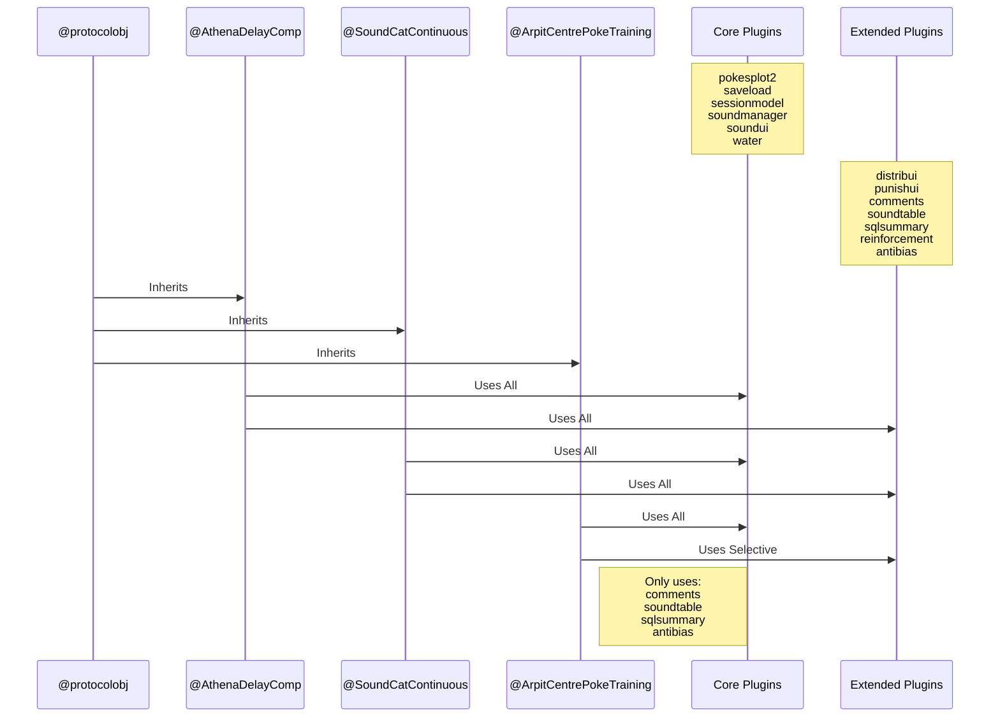

# System Architecture

This document outlines the permanent architecture of the system, including core components, their relationships, and key workflows.

## Core System Components

The diagram below provides an overview of the main system components and their relationships. It shows how the core system, protocol system, and essential plugins interact:

**Core Components Overview:**

- The **Core System** consists of `newstartup.m` (the initialization script) and the Settings Module (configuration management)
- The **Protocol System** includes the base `@protocolobj` class and actively used protocol implementations
- **Essential Plugins** provide functionality grouped by purpose: UI, Data Handling, Sound Management, and Control
- All active protocols inherit from the base protocol class and utilize various essential plugins

## Protocol Plugin Details

This diagram shows the specific plugins used by each protocol and their categorization. It provides a detailed view of how different protocols utilize the plugin system:

**Plugin System Details:**

- **UI Plugins**: Handle visual elements like plots and user interfaces
- **Data Handling Plugins**: Manage data storage, session information, and database interactions
- **Sound Management Plugins**: Control audio stimuli generation and playback
- **Control Plugins**: Manage behavioral control elements like water delivery and reinforcement
- Different protocols have different plugin requirements:
  - `@AthenaDelayComp` and `@SoundCatContinuous` use all plugin categories
  - `@ArpitCentrePokeTraining` uses UI, Data, and Sound plugins but not Control plugins

## System Startup Flow

The diagram below details the full system initialization process, showing how the core components interact during startup and the two possible user interface paths:

**Initialization Process Notes:**

- The initialization begins with `newstartup.m` loading system settings and configuring paths
- After system initialization, users can choose between two interfaces:
  - **Dispatcher**: Used directly by researchers for protocol development and complex experiments
  - **RunRats**: Used by technicians for routine experiment sessions
- The RunRats interface actually initializes Dispatcher behind the scenes as a hidden component
- Both interfaces load protocols from the configured Protocols directory

## Key Components

1. **Core System**
   - `newstartup.m`: System initialization
   - Settings Module: Configuration management

2. **Active Protocols**
   - `@AthenaDelayComp`: Full plugin suite
   - `@SoundCatContinuous`: Full plugin suite
   - `@ArpitCentrePokeTraining`: Basic plugin set

3. **Plugin Categories**
   - UI: Visual interfaces and plotting
   - Data: Storage and session management
   - Sound: Audio control and management
   - Control: Hardware and behavior control

## Plugin Usage

| Protocol | UI | Data | Sound | Control |
|----------|-------|--------|--------|----------|
| AthenaDelayComp | ✓ | ✓ | ✓ | ✓ |
| SoundCatContinuous | ✓ | ✓ | ✓ | ✓ |
| ArpitCentrePokeTraining | ✓ | ✓ | ✓ | - |

## Dependencies and Requirements

1. **Core Dependencies**
   - MATLAB environment
   - Required toolboxes (list specific versions if applicable)
   - System-specific configurations

2. **Protocol Requirements**
   - Each protocol must implement specific interfaces
   - Protocols must handle flush operations appropriately
   - Matrix operations should utilize `rows.m` for consistency

## Best Practices

1. **Protocol Development**
   - Always use `flush.m` for cleanup operations
   - Implement proper error handling
   - Follow established naming conventions

2. **System Configuration**
   - Maintain settings in appropriate modules
   - Document any changes to core components
   - Follow established backup procedures

## Maintenance Guidelines

1. **Core Components**
   - Regular testing of startup sequence
   - Validation of settings management
   - Performance monitoring of critical operations

2. **Documentation**
   - Keep this architecture document updated
   - Document any new dependencies
   - Maintain clear protocol documentation

## Protocol Class Hierarchy

The diagram below illustrates the inheritance structure of protocols and their detailed plugin usage patterns. This provides a more detailed view of how protocols are organized and which specific plugins they utilize:

**Protocol Hierarchy Details:**

- All protocols inherit from the base `@protocolobj` class which provides common functionality
- Plugins are divided into **Core Plugins** (essential for all protocols) and **Extended Plugins** (additional functionality)
- Complex protocols like `@AthenaDelayComp` and `@SoundCatContinuous` use both core and extended plugin sets
- Simpler protocols like `@ArpitCentrePokeTraining` use primarily core plugins with only selective extended plugins
- The specific combination of plugins determines the protocol's capabilities and behavior
- This modular architecture allows for flexible protocol development and reuse of common components
