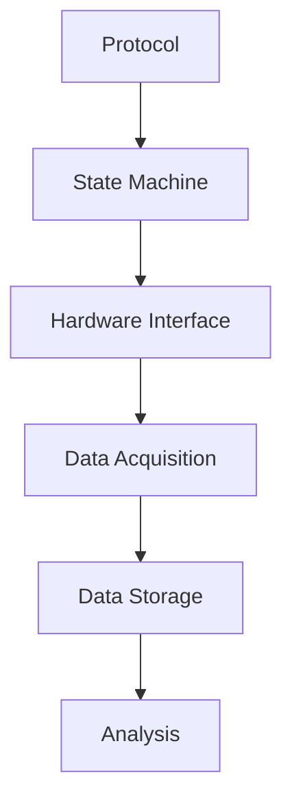

# ExperPort System Overview

## Introduction

ExperPort is a comprehensive behavioral control system designed for rodent experiments. It provides real-time control of experimental parameters, data acquisition, and hardware interfaces.

## System Architecture

### Core Components

1. **State Machine**
   - Finite State Machine (FSM) implementation
   - Real-time control of experiment flow
   - Event-driven architecture

2. **Hardware Interface**
   - LynxTrig for sound control
   - Comedi for digital I/O
   - Real-time Linux server

3. **Data Management**
   - Real-time data acquisition
   - Protocol-based experiment control
   - Data storage and analysis

### Data Flow

## Hardware Integration

### Sound System
- LynxTWO sound card
- Real-time sound triggering
- Sample rates up to 210KHz

### Digital I/O
- Comedi interface
- Parallel port support
- National Instruments cards

### Real-time Control
- RTLinux server
- Hardware interrupts
- Microsecond timing

## Software Components

### Core Modules
1. **State Machine Assembler**
   - Protocol compilation
   - State matrix generation
   - Event handling

2. **Dispatcher**
   - Real-time event processing
   - Hardware control
   - Data logging

3. **Protocol System**
   - Protocol definition
   - Parameter management
   - Experiment control

### Utility Modules
1. **Water Control**
   - Valve control
   - Calibration
   - Monitoring

2. **Sound Management**
   - Sound file handling
   - Playback control
   - Trigger management

3. **Data Analysis**
   - Real-time processing
   - Performance tracking
   - Data visualization

## System Requirements

### Hardware
- LynxTWO sound card
- Compatible I/O hardware
- Sufficient processing power

### Software
- RTLinux 3.1/3.2
- MATLAB
- Required kernel modules

### Network
- Local network connection
- Client-server architecture
- Real-time communication

## Configuration

### Basic Setup
1. Install hardware components
2. Configure kernel modules
3. Set up network connections

### Advanced Configuration
1. Optimize interrupt handling
2. Configure real-time parameters
3. Set up data storage

## Maintenance

### Regular Tasks
1. Hardware calibration
2. Software updates
3. Data backup

### Troubleshooting
1. Hardware diagnostics
2. Software debugging
3. Performance monitoring

## Support

For additional information:
- See [Hardware Setup](../hardware/)
- Refer to [Technical Documentation](../technical/)
- Contact system administrators 